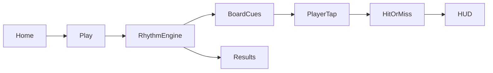

# Pop It Rhythm Game MVP

Build a Flutter MVP that turns a Pop It fidget board into a rhythm game: one board, one beat track, tap highlighted bubbles in time for score/combos with satisfying pop/miss feedback.

## Goal

Replace the counter starter with a single playable rhythm mode: bubbles cue on the beat, the player taps them in time, and hits produce pop feedback + score/combo.

## Core loop

1. Player taps **Play** on a simple home screen.
2. Music/beat starts; a chart drives which bubble lights up and when.
3. Player taps the cued bubble inside a timing window → **Perfect / Good** (points + combo + pop anim + haptic/SFX).
4. Wrong bubble or late/early outside window → **Miss** (combo break + miss flash).
5. Track ends → results sheet (score, max combo, accuracy).

## Concrete defaults (locked for MVP)

- **Board:** rectangular `4 x 5` circle grid (20 bubbles), silicone-toy look (soft colors, inset/outset pop state).
- **Track:** one bundled audio loop + one JSON chart of notes `{ tMs, bubbleId }`.
- **Timing windows:** Perfect ≤45ms, Good ≤120ms, else Miss (tunable constants).
- **Engine:** Flutter `Ticker` + audio position from `just_audio` (no Flame).
- **Feedback:** scale/pop animation, cue glow, hit/miss color flash, light haptic, short pop SFX.
- **Target:** mobile-first (Android/iOS); also runs on Windows/web for quick testing.

## Project layout

Replace starter counter UI under `lib/` with:

- `lib/main.dart` — app entry, theme
- `lib/screens/home_screen.dart` — title + Play
- `lib/screens/game_screen.dart` — board + HUD + results
- `lib/game/models.dart` — `BubbleId`, `Note`, `Judgement`, `HitResult`
- `lib/game/chart.dart` — load `assets/charts/demo.json`
- `lib/game/rhythm_controller.dart` — clock sync, active notes, score/combo, judgement
- `lib/game/widgets/pop_it_board.dart` — grid layout
- `lib/game/widgets/bubble.dart` — pop visual + cue/hit states
- `lib/game/widgets/hud.dart` — score, combo, judgement text
- `lib/audio/audio_controller.dart` — play/seek/position stream
- `assets/audio/demo_beat.wav` — generated 120 BPM demo beat (~32s)
- `assets/audio/pop.wav` — pop SFX
- `assets/charts/demo.json` — note chart for the demo track

Update `pubspec.yaml`: deps `just_audio`, `google_fonts`; use `HapticFeedback` for haptics; declare `assets/`.

## Rhythm engine behavior

- Start audio; poll/listen to `position` as game time `t`.
- Maintain upcoming notes; a bubble is **cued** when `note.tMs - cueLeadMs <= t < note.tMs + goodWindow`.
- On tap of bubble `id`: find nearest unresolved note for that id within Good window → judge and resolve; otherwise Miss.
- Unresolved notes past Miss threshold auto-Miss.
- Score: Perfect 100 / Good 50, multiplied by combo steps (e.g. `1 + floor(combo/10)*0.1`).

## UI / feel

- Full-bleed playful board (no Material “dashboard” chrome on the play surface).
- Brand **Pop It** as the hero on home; game screen focuses on board + minimal HUD.
- Motion: cue pulse before hit, squash/inset on successful pop, brief shake/red on miss.
- Keep first viewport of home simple: brand, one line of instruction, Play CTA.

## Implementation order

1. Scaffold screens + theme; strip counter demo.
2. Build static Pop It board + tap-to-toggle pop visual (no rhythm yet).
3. Add audio controller + demo beat asset.
4. Implement chart + rhythm controller judgements.
5. Wire cues, scoring HUD, SFX/haptics.
6. Add end-of-track results + Replay.
7. Smoke-test on Windows/Chrome; fix asset paths and timing calibration.

## Implementation checklist

- [x] Replace counter starter with home + game screens and Pop It theme
- [x] Build 4x5 Pop It board with pop inset/outset visuals and tap handling
- [x] Add just_audio, demo beat/SFX assets, and demo.json chart loader
- [x] Implement rhythm controller: sync clock, cue notes, Perfect/Good/Miss, score/combo
- [x] Wire HUD, haptics/SFX, miss/auto-miss, and end-of-track results + Replay

## Out of scope for this MVP

Song select, multiple boards/shapes, difficulty tiers, accounts, leaderboards, online multiplayer, custom chart editor.
