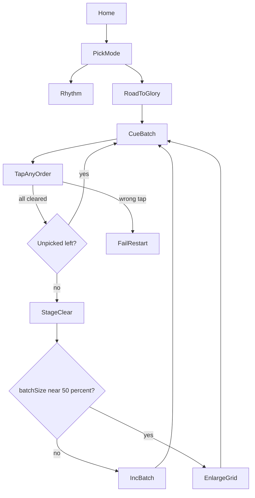

# Road to Glory Mode

Add a separate Road to Glory mode beside Rhythm: clear randomly highlighted batches of N bubbles (any order), grow N after each full clear, enlarge the grid near 50% of bubble count, and fail-to-restart on any miss.

## Decisions locked

- Clear highlighted bubbles in **any order** (no per-batch timer for v1).
- **Separate home option** — keep existing Rhythm; add Road to Glory as a second CTA.
- Miss at any point → lose SFX + restart prompt (hard fail: restart current stage from empty board with same N and grid).
- Already-popped bubbles are never re-highlighted until the stage resets.

## Core loop

1. Start on a `4x5` board (20 bubbles), `batchSize = 2` (base starts at 2).
2. Pick `batchSize` random unpicked bubbles → highlight them together.
3. Player taps those bubbles in any order (wrong bubble or a non-highlighted bubble → **fail**).
4. When the batch is cleared, immediately pick the next batch from remaining unpicked bubbles (still size `batchSize`, or fewer if leftover < batchSize).
5. When the whole board is popped → **stage clear** → bump `batchSize += 1`, reset pops, start again on the same grid.
6. When `batchSize` reaches `ceil(totalBubbles * 0.5)`, after that stage clear → **enlarge grid** (next size), bump base batch `+1`, set `batchSize = base`, continue.

## Grid progression

| Stage grid | Bubbles | Max batch before enlarge (`ceil(n*0.5)`) |
|---|---|---|
| 4x5 | 20 | 10 |
| 5x6 | 30 | 15 |
| 6x7 | 42 | 21 |

Stop enlarging after `6x7` for this slice (can extend later).

## Fail / win UX

- **Fail:** play short lose SFX (`assets/audio/lose.wav`), modal: “Missed — Restart” with Restart + Home.
- **Stage clear:** brief toast / HUD pulse (“Batch size → N+1” or “Grid grows!”), then continue without leaving the screen.
- Popped stones stay inset until stage reset / grid enlarge (same stay-pressed rule as rhythm).

## Project layout (new)

- `lib/screens/home_screen.dart` — two CTAs: **Rhythm** + **Road to Glory**
- `lib/screens/road_to_glory_screen.dart` — board + HUD + fail modal
- `lib/game/road_to_glory_controller.dart` — batch pick, tap validation, stage/grid progression
- Reuse `lib/game/widgets/pop_it_board.dart` / `bubble.dart` with dynamic `rows`/`cols`
- Extend `lib/audio/audio_controller.dart` with lose SFX (and keep pop SFX)
- Generate `assets/audio/lose.wav` via existing `tools/gen_audio.dart` pattern

## Controller API (concrete)

- State: `rows`, `cols`, `batchSize`, `popped`, `activeBatch`, `phase` (`playing` / `failed` / `stageClear`)
- `start()` / `restartStage()` / `onBubbleTapped(id)`
- On tap: if `id` not in `activeBatch` → fail; if in batch → pop, remove from batch; if batch empty → `_dealNextBatch()` or `_onBoardCleared()`
- `_dealNextBatch()`: sample `min(batchSize, remaining)` from unpicked IDs without replacement in that batch
- `_onBoardCleared()`: if `batchSize >= ceil(total*0.5)` and next grid exists → enlarge, `baseBatch += 1`, `batchSize = base`; else `batchSize++`; clear pops; deal first batch

## Implementation order

1. Add lose SFX asset.
2. Implement `RoadToGloryController` + unit tests (batch clear, fail, grow, enlarge).
3. Build `RoadToGloryScreen` (HUD: grid size, batch size, remaining).
4. Split home into two mode buttons; keep Rhythm path intact.
5. Wire pop/lose audio + Chrome reload smoke check.

## Implementation checklist

- [x] Add lose.wav asset
- [x] Implement RoadToGloryController + unit tests
- [x] Build RoadToGloryScreen with HUD and fail/restart modal
- [x] Add separate Rhythm vs Road to Glory CTAs on home
- [x] Wire pop/lose SFX and smoke-test in Chrome

## Out of scope

Timers on batches, Simon-order sequences, online leaderboards, infinite grids beyond 6x7, changing Rhythm mode behavior.
