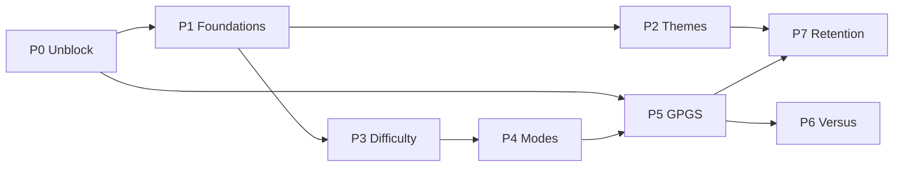

# Pop It — Feature Roadmap

Planned work beyond the MVP in [PLAN.md](PLAN.md). Nothing here is implemented yet.

## Context

Pop It is a working single-player rhythm game: one 4×5 board, one 32s track, one difficulty, one mode, one theme. The Disco Vault re-skin just landed and the core loop feels good — which is exactly why the next step is depth rather than polish.

The ask is eight features: competitive mode, play styles, play with a friend, leaderboard, Google Play Services, bigger bubbles with levels, broader appeal, and theme choice.

The obstacle is that the app has **no structural room for any of them**. There is no app-level state (`PopItApp` is a 23-line `StatelessWidget`), no persistence of any kind, no networking, no INTERNET permission, and every tuning constant and colour is a compile-time `static const` read directly by leaf widgets. Eight features bolted onto that becomes eight tangled refactors.

So this roadmap front-loads the structural work each feature depends on, then ships features in dependency order, each phase independently shippable and visibly better than the last.

### Settled decisions

| Decision | Choice |
| --- | --- |
| Play with a friend | Online realtime versus |
| Leaderboard backing | Google Play Games Services |
| Difficulty model | Timing + note density only; board stays 4×5 |
| Planning scope | Full roadmap phased; Phase 0–1 execution-ready, later phases directional |

### Two constraints worth knowing up front

**GPGS cannot carry realtime versus.** Google deprecated the Real-time and Turn-based Multiplayer APIs in 2019 and shut the servers down in 2020. GPGS v2 gives sign-in, a stable `playerId`, leaderboards, achievements, and saved games — the identity and async-competition layer, nothing more. Versus needs its own transport (Phase 6). GPGS identity still works as the *displayed* player identity inside a match.

**"Bigger bubbles" and "difficulty" must stay separate.** A bigger tap target is a real scoring advantage, so folding bubble size into difficulty would make leaderboards incomparable. Bigger bubbles ship as an independent **Board Scale** setting (Compact / Standard / Chunky) that changes only layout — leaderboard-safe, and honestly framed as comfort/accessibility.

---

## Phase 0 — Unblock

Remove the four things that silently break later phases. No user-visible features; do it first because the Play Console steps have calendar latency.

- **`android/app/build.gradle.kts`** — release currently uses `signingConfig = signingConfigs.getByName("debug")`. Replace with a real `signingConfigs.release` reading `android/key.properties`. **Hard blocker for GPGS**: Play Games matches your signing certificate's SHA-1, and a debug key's SHA-1 is machine-local. Also pin `minSdk = 23` explicitly (currently delegated to `flutter.minSdkVersion`).
- **`android/app/src/main/AndroidManifest.xml`** — add `<uses-permission android:name="android.permission.INTERNET"/>`. Verified: the manifest has **no permission element at all**. Flutter injects INTERNET into debug builds only, so GPGS and versus would work in debug and fail in release — the worst failure mode to find late.
- **Keystore** — generate with `keytool`, add `android/key.properties` to `.gitignore`.
- **Bundle id mismatch** — iOS is `com.popit.popIt`, Android is `com.popit.pop_it`. Normalise both to `com.popit.popit` *before* registering anything in Play Console; this cannot be changed afterwards.
- **`test/widget_test.dart`** — asserts `find.text('Pop It')` and `find.text('Play')`; the redesign renders `'POP\nIT'` and `'PLAY'`, so this test fails today. Rewrite as a smoke test.
- **New `test/rhythm_controller_test.dart`** — `RhythmController` is pure Dart with no Flutter or audio imports, so it unit-tests trivially. Cover the 45ms/120ms judgement boundaries, auto-miss past `tMs + goodWindowMs`, the combo multiplier at 10/20, re-cue after pop, and `reset()`. This is the regression net the Phase 3–4 refactors depend on.

---

## Phase 1 — Foundations *(execution-ready detail)*

Introduce app-level state and persistence, with a real payoff: settings and audio latency calibration.

### State layer — hand-rolled `AppScope`, no package

Do **not** add provider/riverpod. Every service here is a process-lifetime singleton created once and never scoped or swapped, which removes most of what a DI package buys. The codebase already uses `ListenableBuilder` (in `game_screen.dart`) and `RhythmController` is already a `ChangeNotifier` — `AppScope.of(context).settings` + `ListenableBuilder` gives identical rebuild granularity in ~70 lines with zero dependencies. Migrating to `provider` later is mechanical, so this is reversible.

Bootstrap before `runApp` so `PopItApp` stays stateless and there's no loading flash:

```dart
void main() async {
  WidgetsFlutterBinding.ensureInitialized();
  final services = await AppServices.bootstrap();
  runApp(PopItApp(services: services));
}
```

`AppScope` must sit **above `MaterialApp`** — pushed routes and `showModalBottomSheet` build off the Navigator and would not see a scope placed below it. The results sheet would hit this immediately.

### Persistence — `shared_preferences`, two versioned JSON blobs

The dataset is a settings record plus a few dozen personal bests. sqflite/Hive/Isar add a native dependency and a migration story for no benefit.

```
"popit.settings.v1" -> { schemaVersion, themeId, boardScale, audioOffsetMs,
                         sfxVolume, hapticsEnabled, reduceMotion,
                         lastChartId, lastDifficulty, lastMode }

"popit.profile.v1"  -> { schemaVersion,
                         bests: { "<chartId>|<difficulty>|<mode>": {score, accuracy,
                                  maxCombo, perfect, good, miss, grade, atEpochMs} },
                         totals: { runs, notesHit, lifetimeScore, longestCombo },
                         streak: { current, best, lastPlayedYmd },
                         unlockedThemeIds, pendingLeaderboardSubmissions }
```

`schemaVersion` on both with a `migrate(json)` switch, so later phases add fields without wiping bests.

### Files

New — `lib/app/app_scope.dart` (`AppServices.bootstrap()` + `AppScope`), `lib/services/settings_controller.dart`, `lib/services/settings_store.dart`, `lib/services/profile_store.dart`, `lib/services/profile_controller.dart`, `lib/data/player_profile.dart`, `lib/game/chart_library.dart`, `assets/charts/manifest.json`, `lib/screens/settings_screen.dart`, `lib/screens/calibration_screen.dart`, `assets/fonts/*`.

Modified:

- `lib/main.dart` — async bootstrap + `AppScope`.
- `lib/game/models.dart` — `Chart` gains `id`, `bpm`, `artist`; add `ChartMeta`.
- `lib/game/chart.dart` — `loadDemoChart()` (hardcoded to `assets/charts/demo.json`) becomes `parseChart(rawJson, meta)` driven by `ChartLibrary`.
- `lib/screens/game_screen.dart` — `GameScreen({required RunConfig config})`; apply calibration in the position listener as `updateTime(pos.inMilliseconds - settings.audioOffsetMs)`.
- `lib/screens/home_screen.dart` — settings entry point; PLAY passes a `RunConfig`.
- `lib/audio/audio_controller.dart` — add `pause()`, `resume()`, `setSfxVolume()`, `setSpeed()` (Endless Rush needs speed); honour `settings.sfxVolume`.
- `pubspec.yaml` — add `shared_preferences`, plus a `fonts:` section.

**Bundle the fonts.** `google_fonts` currently fetches Archivo Black and Space Grotesk from the network at runtime with no fallback, so a first launch offline renders system fonts and the Disco Vault identity collapses. Bundle both and set `GoogleFonts.config.allowRuntimeFetching = false`. This gets worse in Phase 2 when themes swap fonts.

**Calibration screen** is the visible payoff: metronome loop, 16 taps, median signed offset, "you tap 34ms early". In a rhythm game with leaderboards nothing else buys as much perceived fairness for as little code.

Risks: `Chart` gaining a required `id` touches the demo JSON and loader. An async `main()` means a bootstrap exception is a black screen — wrap in try/catch falling back to in-memory defaults.

---

## Phase 2 — Runtime themes

Feature #8. Goes early because every screen added later would otherwise add more `VaultColors.*` call sites to migrate.

**`ThemeExtension`, not InheritedWidget.** `class VaultPalette extends ThemeExtension<VaultPalette>` registered via `ThemeData.extensions`, read through `context.vault`. It rides `MaterialApp.theme`, so switching themes animates via `lerp()` for free, and `Theme.of` already works correctly inside pushed routes and modal sheets.

**Store ~14 base colours; derive the 8 gradients as getters.** `roomGradient`, `plateGradient`, `wordmarkGradient`, `scoreGradient`, `ctaGradient` should compute from the base colours. This is the difference between a new theme being an afternoon and being a week.

Migrate incrementally: convert `VaultColors` into `const VaultPalette discoVault`, keep `VaultColors` for one phase as `@Deprecated` delegating getters, migrate the 6 consumer files one at a time with tests green between each, then delete it.

Two known frictions:

- **`const` cascade.** Every `VaultColors.*` inside a `const` expression must drop `const`, and Dart cascades that outward — `const BoxDecoration(gradient: VaultColors.roomGradient)` in `game_screen.dart`, the results-sheet border, `plateGradient` in `pop_it_board.dart`, the gradient stops in `bubble.dart`. Mechanical but noisy.
- **Raw hexes in `lib/game/widgets/bubble.dart`** — `0x8CFF2D95`, `0x997BE3FF`, `0x99FFD93D`, `0xD9FFFFFF` duplicate `VaultColors` values with alpha and would not respond to a theme change. Replace with `p.magenta.withValues(alpha: 0.55)` etc., and hoist the resulting gradient into a field computed in `didChangeDependencies()` — this is a repaint-heavy widget.

Fonts parameterise via `displayBase`/`labelBase` on the palette; `vaultDisplay`/`vaultLabel` take `BuildContext`. ~40 mechanical edits, all with `context` already in scope.

Ship 5 palettes: Disco Vault (default), Neon Arcade, Aurora Ice, Sunset Bakery, Midnight Mono — the last three locked, as Phase 7 unlock currency.

Add two golden tests (home + board) at the start of this phase; it's a pure refactor touching every pixel with no visual regression net today.

---

## Phase 3 — Difficulty, levels, bigger bubbles

Features #6 and the difficulty half of #1.

**Inject a `TimingConfig`.** New `lib/game/difficulty.dart` with `Difficulty {easy, normal, hard, expert}`, `TimingConfig`, `DensityProfile`, `DifficultyConfig`. Values: Easy `70/170/700`, Normal `45/120/550` (today's), Hard `32/95/450`, Expert `22/70/380`. `RhythmController` takes `TimingConfig`; `TimingBar` in `lib/game/widgets/hud.dart` takes a plain `int goodWindowMs` passed down rather than importing the difficulty module. Then delete `RhythmTiming` from `models.dart` — it has exactly two consumers.

**Density: algorithmic thinning from one authored master.** 4 difficulties × 5 modes × N songs makes per-difficulty authoring explode and drift. Add optional `int weight` to `Note` (1 = downbeat, 2 = backbeat, 3 = ornament, default 1 so existing JSON still parses); author `demo.json` at Expert density with weights. New `lib/game/chart_shaper.dart` exposes `applyDensity(master, profile)`: keep `weight <= maxWeight`, then drop any kept note within `minGapMs` of the previous. Easy `(1,400)`, Normal `(2,260)`, Hard `(3,150)`, Expert `(3,0)`. **Pure and deterministic — no randomness, no clock** — or two players on Hard get different charts and the leaderboard is meaningless. Unit-test it.

Use **separate leaderboards per difficulty** rather than a global score with a difficulty multiplier; multipliers always let one difficulty dominate.

**Bigger bubbles** — `enum BoardScale {compact, standard, chunky}` drives board `maxWidth` (360/420/480), plate padding, and per-bubble padding in `lib/game/widgets/pop_it_board.dart`. Chunky is ~30% larger. Move `rows`/`cols` out of `_GameScreenState`'s private statics into a `BoardLayout` in `models.dart` — currently nothing else can reach them.

**Extract the results sheet** from `game_screen.dart` into `lib/game/widgets/results_sheet.dart` taking a `RunResult`. Phases 4, 5, and 6 all extend it. While extracting, fix `Navigator.of(this.context).pop()`, which assumes a push stack that the versus flow will violate.

---

## Phase 4 — Game modes

Feature #2, and the async-competitive half of #1.

Five modes driven by an injected `GameRules` object — **not** by subclassing `RhythmController`:

- **Classic** — today's behaviour.
- **Survival** — 5 lives, each miss costs one. The "one more try" hook, cheapest to build.
- **Precision** — only PERFECT scores; GOOD scores zero and breaks combo. Pure skill test, reuses everything.
- **Endless Rush** — chart loops, windows tighten ~8% per loop, ends at 3 misses. Unbounded single number → **this is the async competitive mode** and the leaderboard chase.
- **Versus** — Phase 6, the synchronous competitive mode.

`GameRules` exposes `timingForLoop(loop)`, `startingLives`, `requirePerfect`, `loops`, `scoreFor(...)`, `isRunOver(...)`. `RhythmController` gains `_lives`, `_loop`, `RunOutcome`, and a `buildResult()` returning one `RunResult` that the screen, profile store, leaderboard submitter, and versus room all read. ~60 lines of change to a 202-line class, still pure Dart and fully unit-testable.

**Fix the notification churn here.** `updateTime()` fires `notifyListeners()` on every audio position tick and `game_screen.dart` wraps its whole subtree in one `ListenableBuilder`. Today that's a wasted rebuild; once Phase 6 adds an opponent panel and Phase 7 adds combo FX to that subtree, it becomes a frame-budget problem in a game where frame timing *is* the product. Notify only on score/judgement/cue-set changes (diff the cue set in `_refreshCues`), and expose a separate `ValueNotifier<int> position` for the clock and progress bar.

Risk: Endless Rush loops audio — use `LoopMode.one` and translate position into `(loop, positionInLoop)`; a seek-to-zero has an audible gap.

---

## Phase 5 — Google Play Games Services

Features #4 and #5. Package: `games_services` (maintained GPGS v2 / GameKit wrapper).

Setup order:

1. Release keystore from Phase 0 — **register the SHA-1 Play actually signs with**. With Play App Signing on (default for new apps) that's the certificate under *App integrity → App signing key*, not your upload key. This trips up nearly everyone.
2. Play Console → create app → Play Games Services → Configuration → link a Google Cloud project.
3. OAuth credentials: Android client (package + release SHA-1) and a Web client.
4. Create leaderboards — one per `(mode, difficulty)` worth ranking; start with 4 — and ~10 achievements mapped to Phase 7 unlocks.
5. `games-ids.xml` → `android/app/src/main/res/values/`.
6. Manifest `<meta-data>` for `com.google.android.gms.games.APP_ID` and `com.google.android.gms.version`.
7. **Add yourself to the GPGS Testers list** — before publishing, non-testers get `SIGN_IN_REQUIRED` and you'll lose hours assuming the integration is broken.
8. No `google-services.json` needed for GPGS alone; that arrives with Firebase in Phase 6.
9. iOS maps to Game Center — leave unimplemented, gate the UI on `Platform.isAndroid`.

Sign-in state lives in `lib/services/games_service.dart` (`ChangeNotifier` on `AppServices`). Silent sign-in at boot is fire-and-forget — **never block bootstrap or gameplay on it, and never gate gameplay or theme unlocks on sign-in**. The local profile blob is authoritative; GPGS is a mirror. Failed submissions queue in `pendingLeaderboardSubmissions` and flush on next sign-in — rhythm players play on trains.

For v1, deep-link into the native GPGS leaderboard UI; a custom leaderboard UI needs the REST API and a server.

---

## Phase 6 — Online realtime versus

Feature #3, the headline competitive mode.

**Transport: Firebase Realtime Database + anonymous auth.** Firestore is priced and built around document ops with ~100–300ms listener propagation and no `onDisconnect()` primitive; RTDB is ~50–100ms and purpose-built for "one small JSON object, four times a second", with `ServerValue.timestamp` and `.info/serverTimeOffset` built in. A custom WebSocket server means owning hosting, TLS, scaling, reconnection, and room GC to replace one JSON path.

Identity split: Firebase Anonymous Auth supplies the `uid` security rules key on; GPGS `playerId` + display name are written into the room as the human-visible identity.

**Netcode: periodic score sync — not lockstep, not an authoritative server.** There is no shared world state here, just two independent simulations comparing a scalar. Each client writes its own node ~4×/sec (`score`, `combo`, `accuracy`, `posMs`, `state`) and listens to the opponent's. **Nothing from the opponent enters your simulation**, so latency has zero gameplay effect — it only makes the opponent's number lag <250ms, which reads as live. Throttle writes explicitly to 4Hz; do not wire them to `positionStream`.

Anti-cheat is solved by scoping, not servers: **versus results never feed the global leaderboards.** Friend-vs-friend cheating is self-limiting.

**Don't sync the audio.** You cannot start two `just_audio` players in millisecond agreement. Instead: both clients load and mark ready → host writes `startAtServerMs = ServerValue.timestamp + 3000` → each client converts to local time via `serverTimeOffset`, runs a 3-2-1 countdown, and calls `play()` at that instant → from there each runs on its own audio position. ±150ms drift is irrelevant because judgements are local. Use the synced `posMs` only for an "opponent is at 1:12" indicator. Pause becomes trivially safe. ~50 lines of netcode total.

**Matchmaking: 6-character room code**, share sheet to invite. With no player base, random matchmaking is an empty queue — add it later behind a `queue/` node.

Include a `chartHash` in the room and refuse to start on mismatch, or a future change to Phase 3's density algorithm silently produces unfair matches across app versions.

Prefer adding a `versusRoom` field to `RunConfig` plus an opponent panel over duplicating the 472-line game screen.

---

## Phase 7 — Appeal and retention

Feature #7, and the payoff for Phase 2's theme system.

- **Daily Challenge** — date-seeded chart + difficulty + mode, one attempt per day, its own leaderboard. GPGS supports daily/weekly windows natively, so this is nearly free config over systems already built. Highest-ROI retention feature here.
- **Streaks** — already in the Phase 1 schema; flame badge on home, achievements at 3/7/30 days.
- **Theme unlocks via achievements** — Neon Arcade at 50k lifetime score, Aurora Ice at a 100-combo run, Sunset Bakery at a FLAWLESS grade, Midnight Mono at a first versus win. Unlock state is authoritative **locally** with GPGS as mirror; otherwise an offline player loses earned themes, which is a one-star review.
- **Combo milestone juice** at ×25/50/100 — reuse `ShimmerSweep` and `SpectrumBloom` from `lib/game/widgets/vault_decor.dart`. Respect `reduceMotion`.
- **Share-your-score card** — `RepaintBoundary` → `toImage()` → `share_plus`. ~80 lines, and the only organic acquisition channel.
- **Polish** — per-judgement haptics, a real countdown before the track starts (today music just begins), pause button using Phase 1's `AudioController.pause()`.
- **Casual 3×3 board** — the deferred half of "bigger bubbles": `BoardLayout(3,3)` plus a pure `remapBubbleId(id, from, to)` so 4×5 charts stay playable.

Add `share_plus`. Skip `flutter_animate` — everything here is achievable with `TweenAnimationBuilder`/`AnimatedOpacity`, both already used in `hud.dart`.

---

## Dependency order



P0 → P5 (signing SHA-1 + INTERNET). P1 → everything. P3 → P4 (rules need injectable timing). P4 → P5 (modes worth ranking). P5 → P6 (identity). P5 → P7 (achievements back unlocks).

---

## Verification

**Per phase**

- `flutter analyze` clean and `flutter test` green before moving on. Phase 0 establishes the `RhythmController` unit tests that make Phases 3–4 safe to refactor.
- Run on the Android emulator (`emulator-5554`) via `flutter build apk --debug` + `adb install`, then drive and screenshot with `adb shell screencap`.

**Phase-specific**

- **P0** — build a *release* APK and confirm it installs and reaches the network; the INTERNET fix only manifests in release.
- **P1** — set an audio offset, force-quit, relaunch, confirm it persisted; run calibration and verify judgements shift accordingly.
- **P2** — switch themes at runtime and confirm the board, bubbles (including the specular sweep that currently uses raw hexes), HUD, and results sheet all change. Golden tests for home + board.
- **P3** — unit-test `applyDensity` for determinism (same input → identical output across runs); play each difficulty and confirm note counts and window feel differ.
- **P4** — unit-test each `GameRules`; verify Survival ends at 5 misses and Endless Rush loops without an audible gap.
- **P5** — verify on a *release-signed* build with a Play tester account; confirm queued submissions flush after reconnecting from airplane mode.
- **P6** — two emulators (or emulator + device): create a room, join by code, confirm both countdowns fire together and opponent score updates within ~250ms; kill one client and confirm the other sees the disconnect.
- **P7** — verify a theme unlock survives sign-out and offline relaunch.

---

## Open items

- **Play Console (human)** — create listing from [`store/play_listing.txt`](store/play_listing.txt), Data safety from [`store/data_safety.txt`](store/data_safety.txt), follow [`store/SHIP_CHECKLIST.txt`](store/SHIP_CHECKLIST.txt). Privacy policy URL still required by Play.
- **GPGS (next code pass)** — real APP_ID in `games-ids.xml`, `games_services` package, OAuth SHA-1s, restore APP_ID meta-data, set `GamesService.isConfigured`. Soft-gated for this ship.
- **Firebase friends versus** — RTDB + anonymous auth; lobby friends CTA stays grayed until then.
- **Licensed / authored music** — synth pack remains playable; broader appeal needs real tracks beyond `tools/gen_audio.dart`.
- **iOS Game Center** — deferred; bundle id is ready.

Local interest sprint (results PBs, combo juice, real Daily, mode HUD, coach, bot skill, chart craft, image share) is implemented offline-first.

Ship packaging (label, minSdk 23, no debug release fallback, no fake GPGS APP_ID in manifest) is in place for an offline Android upload.

---

## Checklist

- [x] **P0** Unblock — release signing hook, INTERNET, bundle id, minSdk 23, store label (Play Console listing still human)
- [x] **P1** Foundations — AppScope, persistence, chart registry, calibration
- [x] **P2** Runtime themes — VaultPalette ThemeExtension, 5 palettes
- [x] **P3** Difficulty, board scale, results-sheet extraction
- [x] **P4** Game modes — Classic, Survival, Precision, Endless Rush
- [ ] **P5** Google Play Games Services — sign-in, leaderboards, achievements (soft-gated stub)
- [ ] **P6** Online realtime versus — RTDB rooms, room codes (bots live; friends gated)
- [x] **P7** Appeal and retention — daily, streaks, unlocks, share card (offline)
